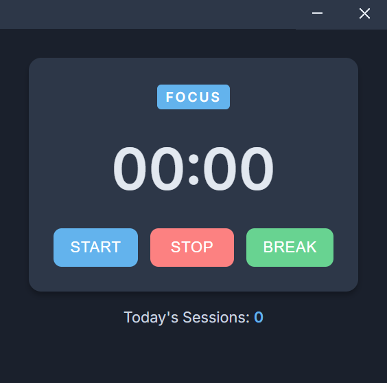
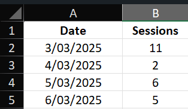

# PomoTimer

A lightweight Electron-based Pomodoro timer that helps you track your work sessions, take regular breaks, and log your progress. This app integrates with external APIs like Beeminder and Pushover to help you stay on track and motivated while maintaining a local history of your sessions.

## Features

- 25-minute focused work sessions
- 5-minute breaks
- Daily progress tracking
- Excel & text file exports
- System tray controls

## Screenshots

## Installation
1. Download/clone the project.
   - `git clone https://github.com/croissant-eater/PomodoroJS`
   - `cd pomodoro-timer`
2. Install [Node.js](https://nodejs.org/dist/v22.14.0/node-v22.14.0-x64.msi).
3. Install Dependencies: 
  - Open a terminal in PomoTimer folder: `npm install`.
4. Update the configuration object in `main.js` with your Pushover token/user and Beeminder authentication token and goal name

## Usage
- Run: `npm start` in the terminal or click on the bash file.
- Use the system tray icon to show or hide the main window.
- Click on UI buttons to start/stop the timer or trigger a manual break.
- The timer automatically transitions between focus (work) and break sessions based on preset intervals.
- Session data is saved in a SQLite database located in your user data directory.
- Daily session counts are written to text files in the PomoSessions folder.
- An Excel workbook (`pomodoro-history.xlsx`) is updated with each session, allowing you to track your progress over time.
